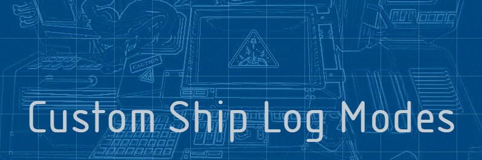
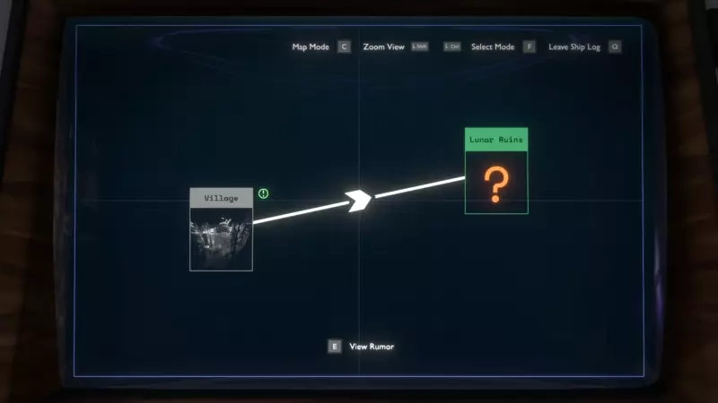

# Custom Ship Log Modes by Damián Garro



This utility mod allows other mods to add their custom Ship Log modes. Now you can [kill demons](https://outerwildsmods.com/mods/doom/), [visit other stars](https://outerwildsmods.com/mods/newhorizons/), [rewatch the best PowerPoint presentations](https://outerwildsmods.com/mods/shiplogslidereelplayerplus/), [view your gallery of photos](https://outerwildsmods.com/mods/picasalbum/) or even [write notes](https://outerwildsmods.com/mods/thehatchlingsjournal/) on your computer without worrying about compatibility issues!

## User Guide

The mod adds a prompt to open a menu to select all the custom and vanilla modes (custom modes are at the top sorted alphabetically and the vanilla modes are at the bottom) using the flashlight key (**F key** by default on the keyboard):



You can also cycle through the modes using the secondary interact key (**C key** by default on the keyboard):


**Note:** If you prefer the Outer Wilds behavior of the secondary interact key, you can disable the *"Cycle through modes"* option in the settings: Pressing the key in the Map Mode would switch to Rumor Mode and vice versa. In the case of a custom mode, pressing the key would change the mode to the default one (Rumor Mode of Map Mode if the former is disabled).  

## Developer Guide

### How to add modes in your mod

Copy the API interface [ICustomShipLogModesAPI.cs](CustomShipLogModes/API/ICustomShipLogModesAPI.cs) to your mod, then use the API to add your mode:
```csharp
var customModesAPI = ModHelper.Interaction.TryGetModApi<ICustomShipLogModesAPI>("dgarro.CustomShipLogModes");
customModesAPI.AddMode(doomMode, () => true, () => "DOOM");
```

You pass your mode itself with the `mode` parameter. With the `isEnabledSupplier` parameter you indicate if the mode is enabled (meaning that the mode is selectable) and with `nameSupplier` the name of the mode (using in prompts and the mode selector menu). You can enable/disable the mode or change its name on the fly with these suppliers, so there's no need to call again `AddMode` for that, for example:

```csharp
// Add the mode but it is disabled for now
Main.HasWarpDrive = false;
API.AddMode(StarChartHandler.ShipLogStarChartMode, 
            () => Main.HasWarpDrive, 
            () => TranslationHandler.GetTranslation("INTERSTELLAR_MODE", TranslationHandler.TextType.UI));

[...]            

// Now you can select the mode!
Main.HasWarpDrive = true;
```

### The ShipLogMode class

Your mode is a `ShipLogMode`. This abstract class is included in the vanilla game and the Map Mode and Rumor Mode implement them (`ShipLogMapMode` and `ShipLogDetectiveMode`). The mode selector menu that this mod uses was is also a `ShipLogMode` (`ModeSelectorMode`). Below are the methods that you need to implement (override) in your mode. You don't call these methods, they are called by the base game or by this utility mod on certain events, you "only" have to implement them. In the following explanation it is described when these methods are called and examples of actions you can do on them.

---
 `public void Initialize(ScreenPromptList centerPromptList, ScreenPromptList upperRightPromptList, OWAudioSource oneShotSource)`

This is called when you add your mode is added (using `AddMode` in the API) if the `ShipLogController` (vanilla component) was initialized (`LateInitialize()` was called on it). If you added the mode before that, the method will be called just after the `ShipLogController` initialization takes place. You probably don't have to worry about that detail. The method is called even if your mode is disabled. 

You can do whatever you want in this method (even nothing, you can leave it empty in that case), for example creating your prompts, UI elements and any initialization you desire. You can also keep the parameters in fields so you can use it later, `centerPromptList` and `upperRightPromptList` are the prompt lists that are already used in vanilla to add some prompts in different positions, and you can use `oneShotSource` to play sounds.

---
`public void EnterMode(string entryID = "", List<ShipLogFact> revealQueue = null)`

This is called when your mode is selected, if this is called you now know that your mode is the currently selected one, congratulations! You should probably show your UI on the computer screen and add prompts here. Another thing you could do is play a sound here if you want.

The `entryID` parameter is the ID of the `ShipLogEntry` that was selected in the previous mode that is exiting (the result of `GetFocusedEntryID()` of that mode) or the empty string (`""`) if none was selected. You are probably not dealing with the actual Ship Log, in that case, you can just ignore it, this is used in the base game to swap between Map and Rumor Mode and keep the same selected entry. The `revealQueue` includes the newly revealed Ship Log facts, but this is mostly `null` or empty because when you enter the computer if the list is not empty then the computer will enter the Rumor Mode by default (unless this is disabled in the settings) to show the cool animations of new things, just ignore that parameter.

---
`public void ExitMode()`

This is called when exiting your mode (to exit the computer or change to another mode). Hide all your UI elements and remove prompts here, but please don't play sounds when this is called! Other modes could play a sound on `EnterMode`, so if the mode is changing from yours to another one, if you play a sound in `ExitMode` then it would overlap with the `EnterMode` sound of the other mode and that would be annoying, so I'm **IMPOSING** this convention (although I have no power and you can ignore the convention, but please don't!). 

---
`public void OnEnterComputer()`

This is called on all modes when the player enters the computer. Here you can do for example some initialization of stuff that could only change between computer sessions, but you would probably ignore this method and leave it empty.

---
`public void OnExitComputer()`

This is called on all modes when the player exits the computer. If your mode was the selected mode, this method is called after `ExitMode` was called, you don't have to worry about hiding UI in that case. Again, you may just ignore this method.

---
`public void UpdateMode()`

This is called each frame where your mode is the current one selected. You can get the input of the user here and act upon it, update UI and animations, and anything you want.

---
`public bool AllowModeSwap()`

Return `true` here if you allow changing to another mode (for example by pressing F or C) while your mode is the current one selected. In most implementations, you always return `true` here, but you could return `false` if for example you are waiting for an animation or some process to finish, but don't forget to return `true` eventually, or else the player would be stuck in your mode!

---
`public bool AllowCancelInput()`

Return `true` here if you allow exiting the computer by pressing the cancel key (**Q key** by default on the keyboard) while your mode is the current one selected. Again, you could return `false` in similar cases to `AllowModeSwap`, but another useful case here is when you are inside a menu withing your mode, and you want the cancel key to exit the menu instead of the computer (this is something that the `ShipLogMapMode` does for example).

---
`public string GetFocusedEntryID()`

This is called when changing from your mode to another one. Return here the ID of the selected `ShipLogEntry` in your mode, or `""` if none is selected (this string will be passed to the next mode with `EnterMode` as explained in that method). In other words, just return `""` here, unless your mode is actually dealing with selecting Ship Log entries. But please don't return random strings or `null`, that would make the vanilla `ShipLogMapMode` and `ShipLogDetectiveMode` fail on `EnterMode` because they assume that the string is either empty or an existing entry ID.

---

Here I provide you an example `ShipLogMode` class called `NoOpMode` that basically does "nothing" (or return the expected default values), you could copy it, rename it and change only the methods that you really want to use (most probably `EnterMode` and `ExitMode`, also `Initialize` and `UpdateMode`):

```csharp
public class NoOpMode : ShipLogMode
{
    public override void Initialize(ScreenPromptList centerPromptList, ScreenPromptList upperRightPromptList, OWAudioSource oneShotSource)
    {
        // No-op
    }

    public override void EnterMode(string entryID = "", List<ShipLogFact> revealQueue = null)
    {
        // No-op
    }

    public override void ExitMode()
    {
        // No-op
    }

    public override void OnEnterComputer()
    {
        // No-op
    }

    public override void OnExitComputer()
    {
        // No-op
    }

    public override void UpdateMode()
    {
        // No-op
    }

    public override bool AllowModeSwap()
    {
        return true;
    }

    public override bool AllowCancelInput()
    {
        return true;
    }

    public override string GetFocusedEntryID()
    {
        return "";
    }
}
```

### Creating UI item lists

As you can see in the API, besides the `AddMode` method there are many more methods all with names that starts with `ItemList`. These are utils that allows you to create and manipulate UI item lists that may be useful for your custom mode. The mode selector itself of this mod uses these methods. The list is almost identical to the one to select entries in Map Mode.

To create one, use the `ItemListMake` method like this:
```csharp
API.ItemListMake(true, true, itemList =>
{
    var itemListWrapper = new ItemListWrapper(API, itemList);
    // Now we can use the list with the wrapper!
});
```

The first and second parameters are the `bool usePhoto` and `bool useDescField`, with these you can choose to show or not the square used for the photo (or question mark) and the description field (the one below the list that in Rumor Mode and Map Mode shows the facts of an entry). 

When one of these is `false`, the area of the rest of the elements is expanded horizontally or vertically to use the space left (the mode selector does this). This cannot be changed once the list is created (at least not currently), consider using different separate item lists if you want one that shows different additional UI elements. 

Also note that if you use the photo and not the description field, the photo wouldn't be square anymore and the sprite could be stretched, so in that case you could set the [preserveAspect](https://docs.unity3d.com/2019.1/Documentation/ScriptReference/UI.Image-preserveAspect.html) property of the `Image` (the one returned by `GetPhoto`). This could even be useful if you use both the photo and the description field but the sprite you use isn't an square.

The third parameter is the `Action<MonoBehaviour> callback`. This is used to return the created item list, but it does it with a callback instead of a return value because when you call this method there might be some pending initialization that this mod has to do and may be unable to return the item list on the frame you request it.

Once you have the item list (represent by a `MonoBehaviour`) received by your callback, you could use it in the other API `ItemList*` methods (they all take the `MonoBehaviour itemList` as a first parameter). However, like the example above shows, you can also use the `ItemListWrapper`, just copy the [ItemListWrapper.cs](CustomShipLogModes/API/ItemListWrapper.cs) file and create one passing the API and the item list. That way, instead of using the list like this:
```csharp
API.ItemListSetSelectedIndex(itemList, 0);
API.ItemListSetName(itemList, "Cool Name");
API.ItemListGetPhoto(itemList).gameObject.SetActive(true);
API.ItemListUpdateList(itemList);
```
you could do this instead:
```csharp
itemListWrapper.SetSelectedIndex(0);
itemListWrapper.SetName("Cool Name");
itemListWrapper.ItemListGetPhoto().gameObject.SetActive(true);
itemListWrapper.UpdateList();
```

Note that your "own" *MOST* of the UI elements of the list, so you could modify it in any way you want (for example, changing colors or sizes) without affecting other mods or the base game, although the API doesn't currently facilitates these actions. However, the description field is the same object shared by the vanilla Rumor Mode and Map Mode, as well as other item lists created with this mod, so take this into consideration. In the future, this could be changed and a copy of the description field could be copied to each of the item lists created by this mod.  

There's also a variation of the `ItemListMake` method that just take one `bool usePhotoAndDescField` instead of the two separated. Calling with `true` is the same as using the other method with both parameters with `true`, same with `false`. **This version of the method is deprecated and just kept for retro-compatibility.** 

The rest of this section describes the `ItemListWrapper` methods, each of them corresponds one of the API `ItemList*` methods (all except the `ItemListMake` methods that we already covered).

---
`public void Open()`

Displays the item list UI  the Ship Log computer screen. The elements are displayed using animations. You could use this method for example in the `EnterMode` of your custom mode.

Opening the list also includes opening the description field if the item list was created with `useDecField = true`, it uses the `SetVisible` method of the shared vanilla `ShipLogEntryDescriptionField`.

---
`public void Close()`

Hides the item list UI, also with animations. You could use this method for example in the `ExitMode` of your custom mode.

Opening the list also includes closing the description field if the item list was created with `useDecField = true`, it uses the `SetVisible` method of the shared vanilla `ShipLogEntryDescriptionField`.

---
`public int UpdateList()`

If there are at least two items, takes the user input to navigate the list, changing the selected item in that case. The returned `int` value indicates how much the index of the selected item changed (`-1` means that the selection was changed to the item above, `0` that the selection wasn't changed, and `1` that the selection was changed to the item below). You could use that value for example to know if you should display things in the description field or change the photo image.

Additionally, and also very important, this method refreshes the UI of the list items, according to the available items, the selected index, their text and icons. Remember that the UI could show less items that the ones available: it shows up to **7** items if the list was created with `useDecField = true` (this is the same number of items that you see in the vanilla Map Mode) and **14** if `false`. When the user navigates the list the items are scrolled.

---
`public void UpdateListUI()`

Similar to `UpdateList` but this just updates the UI, it doesn't take the user input to navigate the list (and doesn't return a value).

---
`public void SetName(string nameValue)`

Changes the text showed above the list of items, by default it displays the empty string `""`. You could change it to display the name of your mode for example.

---
`public void SetItems(List<Tuple<string, bool, bool, bool>> items)`

Sets the items of the list, each of them is represented by a `Tuple` with 4 elements that are used to display the item in the list:
* The `string` is the name of the item.
* The first `bool` indicates if the icon of the green down arrow (the one that in vanilla shows if the location is marked on HUD) should be shown
* The second `bool` indicates if the icon of the green exclamation mark (the one that in vanilla is used to indicate that there are unread facts) should be shown
* The third `bool` indicates if the icon of the orange asterisk (the one that in vanilla is used to indicate that there is more to explore there) should be shown

Note that this elements are only visuals and it is up to you to decide their meaning or functions. For example, you may want to display the _"There's more to explore here."_ text in the description field when an item that you made to have that icon is selected, or it could mean something entirely different, but it's also a good idea to maintain the visual language of the base game as similar as possible.

---
`public int GetSelectedIndex()`

Returns the zero-based index of the selected index (0 is the first, 1 is the second and so on). Note that, for example, if this returns 6 it doesn't mean that this is the seventh element currently displayed counting from above, because of the scrolling. In fact, all items with index >= 4 will be at the fifth displayed item when selected.

Outside of the item list itself you would probably maintain a list of objects that are represented by the UI items (the ones you set in `SetItems`), you could use the selected index to get some data from that list and do any action you want (for example, displaying info on the description field when an item is selected).

---
`public void SetSelectedIndex(int index)`

Changes the index of the selected index. For example, when the user enters to your mode, you may want the item list to be positioned at a particular index.

This is the only way to change the index besides the user navigation in `UpdateList`. The index starts at 0 when the list is created.

---
`public Image GetPhoto()`

Returns the `Image` component of the object used to display images available if the item list was configured with `usePhoto = true`. The object is disabled by default, you may enable it and set its sprite to any image you want.

---
`public Text GetQuestionMark()`

Returns the `Text` component of the object used to display a text (by default an orange question mark that in vanilla is used for rumored entries) at the same space where the photo is, available if the item list was configured with `usePhoto = true`. The object is disabled by default, you may enable if and set its sprite to any text you want (it doesn't have to necessarily be a question mark, it could be anything).

---
`public void DescriptionFieldClear()`

Clears the shared description field (`ShipLogEntryDescriptionField`) used by other item lists and the vanilla Rumor Mode and Map Mode. It's similar to the vanilla `SetText` method of `ShipLogEntryDescriptionField` but instead of clearing all but one fact items, it clears them all.

As the field is shared by others, it may be a good idea to always clear it when you open your list, otherwise it could display items from others. But it's also useful to clear it just before showing info of a particular selected item for example (see the method below for this).

---
`public ShipLogFactListItem DescriptionFieldGetNextItem()`

Displays the next `ShipLogFactListItem` with an empty string (intended to be changed by you). It also returns that newly displayed `ShipLogFactListItem`, that you would use to display any text you want (you could use the `DisplayText` method of the item for example).

The game starts with 10 `ShipLogFactListItem` objects by default, that are enabled or disabled depending on how many facts are to be displayed. This number is enough for all vanilla situations, but you may use more items. Don't worry, `DescriptionFieldGetNextItem` creates a new object if all existing items are already displayed.

---
`public void MarkHUDRootEnable(bool enable)`

Makes the "Mark on HUD" rectangle object active or inactive depending on the parameter (this object starts disabled by default). This root includes the border, background and the screen prompts that are displayed in the lower part of the photo or question mark square (and so it could cover part of the photo), all these elements are made visible or invsible using this method.

---
`public ScreenPromptList MarkHUDGetPromptList()`

Returns the `ScreenPromptList` of the "Mark on HUD" rectangle, initially empty (no prompts), so you could add your prompts.

In the vanilla Map Mode this is used for the "Mark Location on HUD"/"Remove HUD Marker" prompt, but of course you could use it for whatever you want.

---
`public List<ShipLogEntryListItem> GetItemsUI()`

Returns the list of all `ShipLogEntryListItem` used to display the items in order from top to bottom. All UI items are returned, including the ones that aren't currently used to display elements, and in fact **14** items are always returned even if the description field is used (that only allows **7** items to be displayed at most), because the others items are never destroyed when creating the list (this detail isn't probably relevant to you but just in case).

---
`public int GetIndexUI(int index)`

Returns the index of the UI item used to display the item with the given `index`, or `-1` if the item with `index` isn't currently displayed (because of scrolling). This could be combined with `GetItemsUI`. For example, `itemListWrapper.GetItemsUI()[itemListWrapper.GetIndexUI(itemListWrapper.GetSelectedIndex())]` returns the `ShipLogEntryListItem` of the currently selected item.
